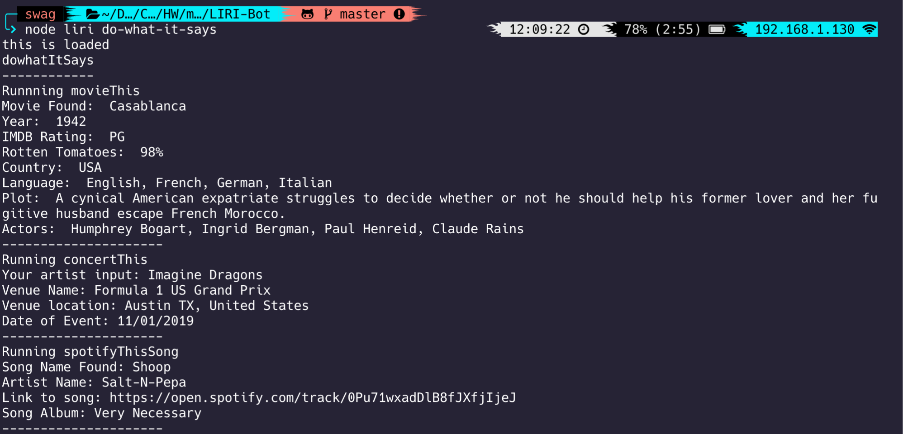
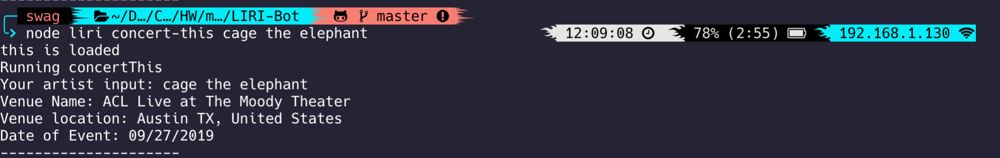
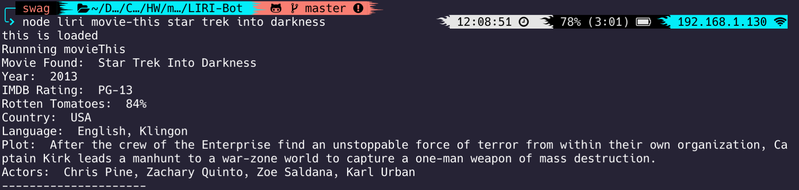

# LIRI-Bot

LIRI Bot that retrieves data from Spotify API, OMDb API and Bands In Town API

- [LIRI-Bot](#liri-bot)
  - [How to Run](#how-to-run)
    - [Commands](#commands)
      - [Get spotify song data from the Spotify api](#get-spotify-song-data-from-the-spotify-api)
      - [Get data about a band or artist concert coming up with the Bands In Town API](#get-data-about-a-band-or-artist-concert-coming-up-with-the-bands-in-town-api)
      - [Get data about a movie with the OMDb API](#get-data-about-a-movie-with-the-omdb-api)
      - [Run a list of these commands in a random.txt file](#run-a-list-of-these-commands-in-a-randomtxt-file)
  - [Codeflow Organization](#codeflow-organization)

## How to Run

This app runs API calls which require keys. The Spotify key is not included in this repo.  
A .env file must be created in this format to run the spotify-related commands

```
SPOTIFY_ID[YOUR-SPOTIFY-ID]
SPOTIFY_SECRET=[YOUR-SPOTIFY-SECRET]
```

This app runs with node.js. If you do not have node.js installed, it will not run.
This app also utilizes five node modules as shown being imported below

```js
require("dotenv").config(); //dot env reader
var Spotify = require("node-spotify-api"); //spotify package
var moment = require("moment"); //moment package
var axios = require("axios"); //axios
var fs = require("fs"); //file reader thing
```

To ensure node is working and the packages are installed run:

```bash
$ npm i dotenv
$ npm init -y
$ npm i node-spotify-api
$ npm i axios
$ npm i moment
```

### Commands

This node.js bot takes four commands, three of which require a second argument.

#### Get spotify song data from the Spotify api

`$ node liri spotify-this-song [SONG NAME]`


#### Get data about a band or artist concert coming up with the Bands In Town API

`$ node liri concert-this [ARTIST OR BAND]`


#### Get data about a movie with the OMDb API

`$ node liri movie-this [MOVIE NAME]`


#### Run a list of these commands in a random.txt file

The random.txt is formatted as follows

```
spotify-this-song,"Shoop"
concert-this,"Imagine Dragons"
movie-this,"Casablanca"
```

To run:
`$ node liri do-what-it-says`


## Codeflow Organization

Liri reads the first input and runs the corresponding function with a switch case. Each command action uses it's own function to run.
Except for do-what-it-says, the other cases require a second parameter which is read.

OMDB and Bands in Town ultilize axios to make the API call, while Spotify uses the Spotify node package.
